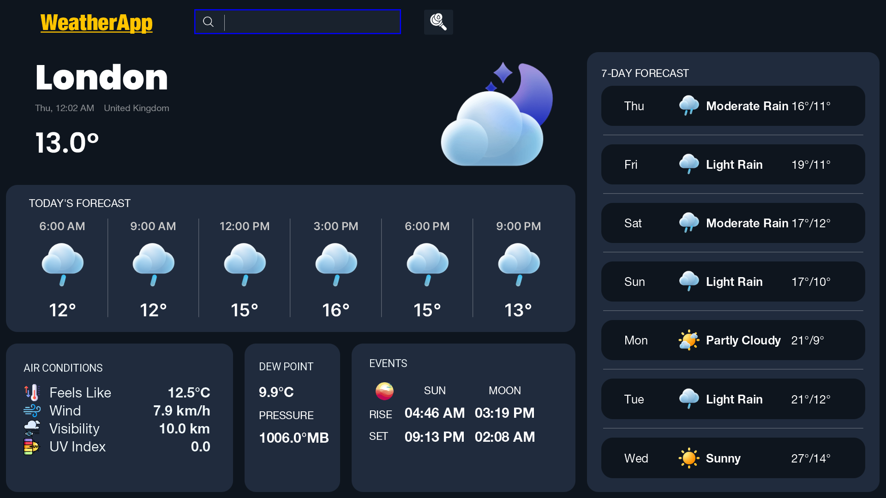

# 🌤️ WeatherApp

**WeatherApp** is a real-time Java-based weather dashboard built with **JavaFX**, utilizing the **Java HTTP Client** for real-time weather data retrieval from external APIs and **Jackson** for JSON parsing. Designed with an intuitive UI and clean MVC architecture, the app displays current, hourly, and daily forecasts with real-time updates.

> **Corresponding video:** https://youtu.be/jkdAjw-tcz4?si=_H7eRAY5ugX8kPUH



---

## 📌 Features

- 🔍 **City Search**: Enter any city name to get live weather updates.
- 🌡️ **Current Weather**: Displays temperature, UV index, pressure, dew point, visibility, wind speed, and “feels like” temperature.
- 📅 **Forecasts**: Hourly and daily weather forecasts presented in a user-friendly interface.
- 🌐 **Live Data**: Retrieves real-time data using an external weather API.
- 🖼️ **Dynamic Icons**: Weather conditions are mapped to context-aware icons using enums.
- 💡 **Lombok Integration**: Simplifies model class definitions with annotations.

---

## 🧩 Main Components

- **`module-info.java`**: Defines modular structure using the Java Module System.
- **`App.java`**: Launches the JavaFX application.
- **Models**:
    - `WeatherData`: Core weather model with all relevant attributes.
    - `DailyForecast`: Daily forecast data.
    - `HourlyForecast`: Hourly forecast data.
    - `Icon`: Simple model mapping weather labels to icon image paths.
    - `WeatherCondition`: Enum that maps descriptive conditions to icon resources based on time of day.
- **Controllers**: Manage JavaFX UI behavior and user interaction logic.
- **Service Layer**: Connects API client to data parsing logic and app logic.

---

## 🛠️ Tech Stack & Dependencies

| Component         | Purpose                                           |
|------------------|---------------------------------------------------|
| JavaFX           | UI rendering and interaction                      |
| Java HTTP Client | Making HTTP requests to weather APIs              |
| Jackson          | JSON parsing (`jackson-core`, `jackson-databind`) |
| Lombok           | Reduces boilerplate in model classes              |

---

## ⚙️ Build & Configuration

This project uses **Maven** for build automation and dependency management.

- **Java Version**: 23+
- **Build Tool**: Maven with `javafx-maven-plugin`
- **Compiler Plugin**: Configured for Java 23
- **Project Configuration**: Managed in `pom.xml`

---

##  🚀 Getting Started

```bash
# Clone the repository
git clone https://github.com/10xDeVv/Weatherly.git

# Build the project
mvn clean install

# Run the JavaFX app
mvn javafx:run

📂 Folder Structure

org.example.weatherapp/
├── App.java                          # JavaFX application entry point
├── module-info.java                  # Java module definition
├── controllers/                      # JavaFX controllers
├── models/                           # Weather data models
├── service/                          # Weather API service and logic

weatherly/
├── App.java                         # JavaFX application entry point
├── module-info.java                 # Java module definition
├── client/
│   └── WeatherApiClient.java        # Handles API calls via HTTPClient
├── service/
│   └── ApiService.java              # Connects client and parser
├── utility/
│   ├── WeatherParser.java           # Parses JSON responses
│   ├── DateFormatter.java           # Formats date & time display
│   └── IconUtility.java             # Selects weather icons (day/night)
├── models/
│   ├── WeatherData.java             # Aggregates weather information
│   ├── DailyForecast.java
│   ├── HourlyForecast.java
│   ├── Icon.java
│   └── WeatherCondition.java
├── controllers/
│   ├── MainWeatherController.java
│   ├── DailyForecastController.java
│   └── HourlyForecastController.java
├── fxml/
│   └── MainWeatherView.fxml         # Declarative UI layout
├── icons/                           # Weather icons (big, medium, small)
├── screenshots/                     # App screenshots (optional)
└── README.md

```

## 🔐 API Configuration

To use this app, you'll need a free API key.

### 1. 🔑 Get Your API Key
Sign up at [WeatherAPI on RapidAPI](https://rapidapi.com/weatherapi/api/weatherapi-com/) and copy your `X-RapidAPI-Key`.

### 2. 💻 Set Environment Variable

**Windows (CMD):**  
`set API_KEY=your_rapidapi_key_here`

**macOS/Linux (bash/zsh):**  
`export API_KEY=your_rapidapi_key_here`

Then run the app as usual with:  
`mvn javafx:run`